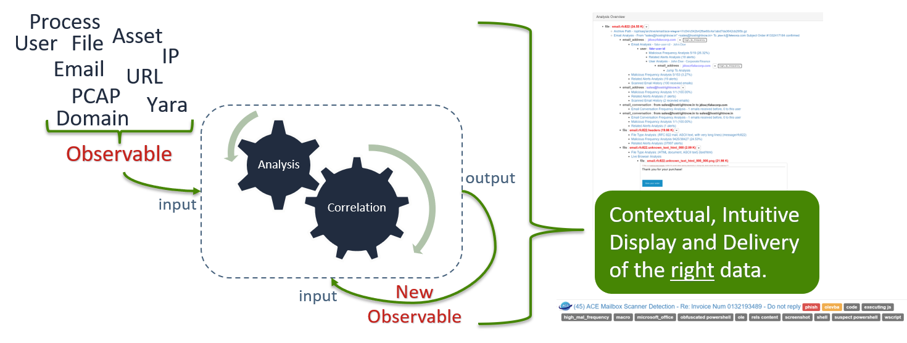

# ACE - Analysis Correlation Engine

ACE is a detection system and automation framework. ACE’s foundation is its engine for recursive analysis and its intuitive presentation to your analysts. ACE's goal is to reduce the analyst's time-to-disposition to as close to zero as humanly possible.

While ACE is a powerful detection system, and does have built in detections, ACE does not ship with all of the yara signatures and intel detections that teams have built around it. However, ACE makes it easy to load your own yara signatures and atomic indicator detections.

Alerts are sent to ACE, and ACE handles the ordinary, manual, redundant, and repetitive tasks of collecting, combining, and relating data. ACE will then contextually and intuitively present all the right data to the human, allowing for a quick, high confidence determination to be made.

Got some new analysis that can be automated? Awesome! Add your automation, and let ACE keep working for you.

For the most part, custom hunting tools send alerts to ACE using ACE’s client library (API wrapper). ACE then gets to work by taking whatever detectable conditions it’s given and spirals out through its recursive analysis of observables, hitting as many detection points as possible across the attack surface.

ACE is the implementation of a proven detection strategy, a framework for automating analysis, a central platform to launch and manage incident response activates, an email scanner, and much more.

### Major Features

+ Email Scanning
+ Recursive File Scanning
+ URL Crawling and Content Caching
+ Intuitive Alert Presentation
+ Recursive Data Analysis & Correlation
+ Central Analyst Interface
+ Event and Incident Management
+ Intel Ingestion
+ Modular Design for extending automation

## The Super Fast, Getting Started Steps
1. Clean Ubuntu 18 install. Take a quick look at [these notes about Ubuntu 18](https://github.com/IntegralDefense/ACE/wiki/Ubuntu-18-Installation-Notes).
2. Create username/group ace/ace.
3. Add ace to sudo.
4. Login as user ace.
5. `sudo mkdir /opt/ace && sudo chown ace:ace /opt/ace && cd /opt/ace`
6. `git clone https://github.com/IntegralDefense/ACE.git .`
7. `./installer/source_install`
8. `source load_environment`
8. `./ace add-user username email_address`
9. Goto https://127.0.0.1:5000/ace/ or whatever IP address you're using.

## Built for the InfoSec Team

Regardless of skill level, ACE greatly reduces the time it takes an analyst to make a high confidence alert disposition. This reduction in time-to-disposition, coupled with the appropriate hunting and tuning mindset, means that security teams can greatly increase their attack surface coverage, all while utilizing the same amount of analyst time and practically eliminating alert fatigue. Optimization good, alert fatigue bad.

## Analyst Demo

The following YouTube video provides a tour of the ACE GUI and demonstrates how to work some alerts.

## Philosophy

For a more in-depth understanding of the philosophy behind ACE, see the talk that John Davison gave on the development of the ACE tool set at BSides Cincinnati in 2015.

## Documentation

View ACE's full documentation here: [https://ace-analysis.readthedocs.io/en/latest/](https://ace-analysis.readthedocs.io/en/latest/)
