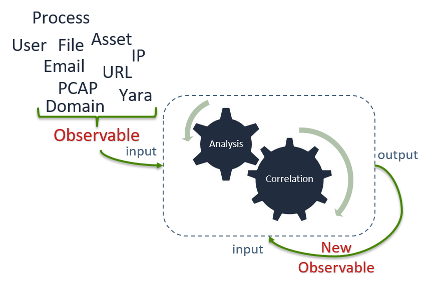
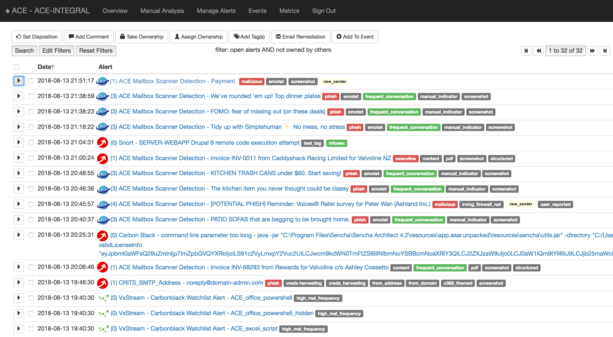
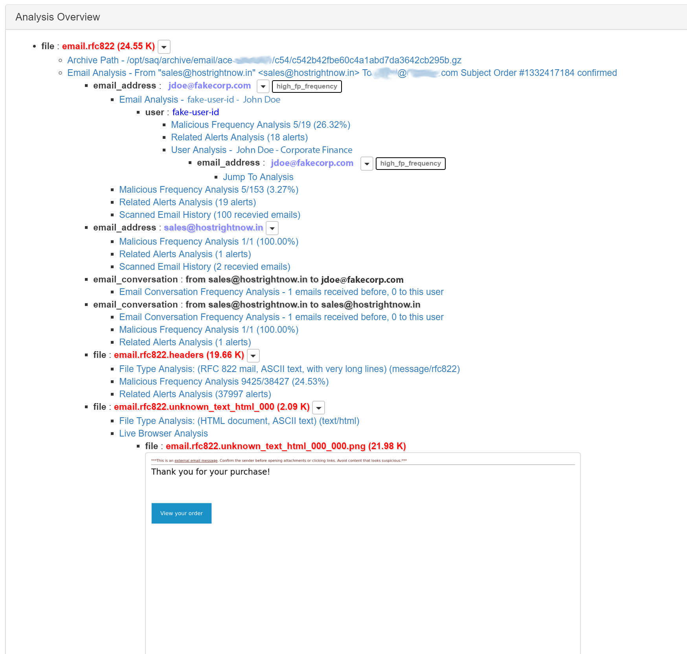
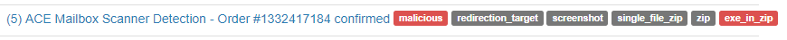
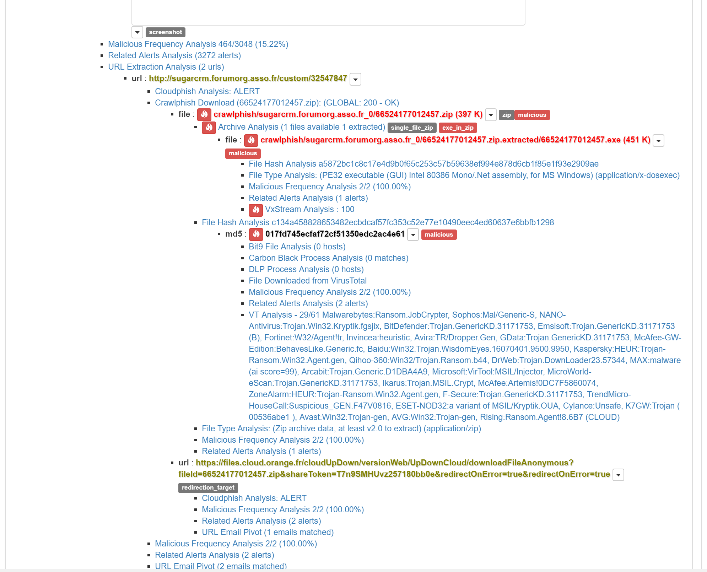

.. role:: strike
   :class: strike

.. _analyst-orientation:

Analyst Orientation - Start Here
================================

Keep this in mind when working ACE alerts: ACE is meant to enable the Analyst to QUICKLY disposition false positive alerts, and recognize true positives. 

.. Purspose of ACE: Quick, and accurate disposition of false postive alerts. So more time can be spent looking at the true postives.

.. _concepts-intro:

Quick Concept Touchpoint
------------------------

There are two core concepts an analyst must be familiar with when working ACE alerts, Observables and Dispositioning. If the term :ref:`Alert Triage <alert-triage>` is not familiar to you, see the :ref:`Alert Triage <alert-triage>` section first.

.. _observable:
.. _Observables:

Observables
~~~~~~~~~~~

.. _alert-triage:

First, observables are anything an analyst might "observe" or take note of during an investigation or when performing Alert Triage. For instance, an ip address is an observable and a file name is a different type of observable. Some more observable types are: URLs, domain names, usernames, file hashes, file names, file paths, email address, and yara signatures.

Moving on, ACE knows what kind of analysis to perform for a given observable type and how to correlate the value of an observable accross all availble data sources. In the process of correlating observables with other data sources, ACE will discover more observables to analyze and correlate.

When an ACE Alert is created from an initial detection point, the Alert's 'root' level Observables are found in the output of that initial detection. ACE then gets to work on those root observables. An ACE Alert's status becomes complete when ACE is done with its recursive analysis, correlation, discovery, and relational combination of Observables. The final result is an ACE Alert with intuitive context ready for the human analyst's consumption.

The figure below is meant to give a visual representation ACE's recursive observable analysis and correlation. 

.. _ace-core:

   Recursive Observable Analysis

ACE’s correlation of observables reduces and simplifies the analysts workload by providing the analyst with as much available context as reasonably possible. A complete list of currently defined observable types can be viewed in the table below.

.. _observable-table:

Currently defined ACE observables:
++++++++++++++++++++++++++++++++++

==================  ===================================================================================================
Observable Type     Description
==================  ===================================================================================================
asset               a F_IPV4 identified to be a managed asset
cidr                IPv4 range in CIDR notation
email_address       email address
email_conversation  a conversation between a source email address (MAIL FROM) and a destination email address (RCPT TO)
file                path to an attached file
file_location       the location of file with format hostname@full_path
file_name           a file name (no directory path)
file_path           a file path
fqdn                fully qualified domain name
hostname            host or workstation name
http_request        a single HTTP request
indicator           crits indicator object id
ipv4                IP address (version 4)
ipv4_conversation   two F_IPV4 that were communicating formatted as aaa.bbb.ccc.ddd_aaa.bbb.ccc.ddd
md5                 MD5 hash
message_id          email Message-ID
pcap                path to a pcap formatted file !!! DEPRECATED (use F_FILE instead)
process_guid        CarbonBlack global process identifier
sha1                SHA1 hash
sha256              SHA256 hash
snort_sig           snort signature ID
url                 a URL
user                an NT user ID identified to have used a given asset in the given period of time
yara_rule           yara rule name
==================  ===================================================================================================

.. _dispositioning:

Alert Dispositioning
~~~~~~~~~~~~~~~~~~~~

.. include:: <isonum.txt>

When making a determination about an Alert, there is a categorization model for Anaylsts to follow called Dispositioning. The Disposition model that ACE uses is based on Lockheed Martin's `Cyber Kill Chain <https://www.lockheedmartin.com/en-us/capabilities/cyber/cyber-kill-chain.html>`_ |reg| model for identifing and describing the stages of an adversaires attack. The table below describes each of the different dispositions used by ACE.

.. _ace-dispositions:
.. _dispositioned:

+---------------------+--------------------------------------------------------------------------------------------------------------+
|  Disposition        |                                       Description / Example                                                  |
+=====================+==============================================================================================================+
| FALSE_POSITIVE      | Something matched a detection signature, but that something turned out to be nothing.                        |
|                     |                                                                                                              |
|                     | + A signature was designed to detect something specific, and this wasn't it.                                 |
|                     | + A signature was designed in a broad manner and, after analysis, what it detected turned out to be benign.  |
+---------------------+--------------------------------------------------------------------------------------------------------------+
| IGNORE              | This alert should have never fired. A match was made on something a detection was looking for but it was     |
|                     | expected or an error.                                                                                        |
|                     |                                                                                                              |
|                     | + Security information was being transferred.                                                                |
|                     | + An error occurred in the detection software generating invalid alerts.                                     |
|                     | + Someone on the security team was testing something or working on something.                                |
|                     |                                                                                                              |
|                     | It is important to make the distinction between FALSE_POSITIVE and IGNORE dispositions, as alerts marked     |
|                     | FALSE_POSITIVE are used to tune detection signatures, while alerts marked as IGNORE are not. IGNORE alerts   |
|                     | are deleted by cleanup routines.                                                                             |
+---------------------+--------------------------------------------------------------------------------------------------------------+
| UNKNOWN             | Not enough information is available to make a good decision because of a lack of visibilty.                  |
+---------------------+--------------------------------------------------------------------------------------------------------------+
| REVIEWED            | This is a special disposition to be used for alerts that were manually generated for analysis or serve       |
|                     | an informational purpose. For example, if someone uploaded a malware sample from a third party to ACE, you   |
|                     | would set the disposition to REVIEWED after reviewing the analysis results. Alerts set to REVIEWED do not    |
|                     | count for metrics and are not deleted by cleanup routines.                                                   |
+---------------------+--------------------------------------------------------------------------------------------------------------+
| GRAYWARE            | Software that is not inherently malicious but exhibits potentially unwanted or obtrusive behavior.           |
|                     |                                                                                                              |
|                     | + Adware                                                                                                     |
|                     | + Spyware                                                                                                    |
|                     |                                                                                                              |
|                     | :strike:`If desired, this disposition can be used to categorize spam emails.`                                |
+---------------------+--------------------------------------------------------------------------------------------------------------+
| POLICY_VIOLATION    | In the course of an investigation, general risky user behavior or behavior against an offical policy or      |
|                     | standard is discovered.                                                                                      |
|                     |                                                                                                              |
|                     | + Installing unsupported software                                                                            |
|                     | + Connecting a USB drive with pirated software                                                               |
|                     | + Browsing to pornographic sites                                                                             |
+---------------------+--------------------------------------------------------------------------------------------------------------+
| RECONNAISSANCE      | Catching the adversary planning, gathering intel, or researching what attacks may work against you.          |
|                     |                                                                                                              |
|                     | + Vulnerability and port scanning                                                                            |
|                     | + Attempts to establish trust with a user                                                                    |
+---------------------+--------------------------------------------------------------------------------------------------------------+
| WEAPONIZATION       | The detection of an attempt to build or use a cyber attack weapon, that was stopped or failed.               |
|                     |                                                                                                              |
|                     | + IPS/Proxy blocks to exploit kits that stopped an attack from being delivery                                |
|                     | + SMTP filter/IPS that blocks a phish from being delivery to an inbox                                        |
|                     | + AV deleting a malicious file before it was written to disk, such as on an inserted USB device              |
+---------------------+--------------------------------------------------------------------------------------------------------------+
| DELIVERY            | An attack was attempted, and the attack's destination was reached. Even with no indication the attack worked.|
|                     |                                                                                                              |
|                     | + A user browsed to an exploit kit                                                                           |
|                     | + A phish was delivered to the email inbox                                                                   |
|                     | + AV detected and remediated malware after the malware was written to disk                                   |
+---------------------+--------------------------------------------------------------------------------------------------------------+
| EXPLOITATION        | An attak was DELIVERED and there is evidence that the EXPLOITATION worked in whole or in part.               |
|                     |                                                                                                              |
|                     | + A user clicked on a malicious link, from a phish, but the proxy blocked the connection                     |
|                     | + A user opened and ran a malicious email attachment, but AV blocked the execution from completing           |
|                     | + A user hit an exploit kit, a Flash exploit was attempted, but the firewall's IPS blocked it                |
+---------------------+--------------------------------------------------------------------------------------------------------------+
| INSTALLATION        | An attack was DELIVERED and the attack resulted in the INSTALLATION of something to maintain persistence on  |
|                     | an asset/endpoint/system.                                                                                    |
|                     |                                                                                                              |
|                     | + A user browsed to an exploit kit and got malware install on their system                                   |
|                     | + A user executed a malicious email attachment, and malware was installed                                    |
|                     | + Malware executed, off a USB, and installed persistence on an endpoint                                      |
+---------------------+--------------------------------------------------------------------------------------------------------------+
| COMMAND_AND_CONTROL | An attacker was able to communicate between their control system and a compromised asset. The adversary has  |
|                     | been able to establish a control channel with an asset.                                                      |
|                     |                                                                                                              |
|                     | Example Scenario: A phish is DELIVERED to an inbox and a user opens a malicious word document that was       |
|                     | attached. The word document EXPLOITS a vulnerability and leads to the INSTALLATION of malware. The malware is|
|                     | able to communicate back to the attackers COMMAND_AND_CONTROL server.                                        |
+---------------------+--------------------------------------------------------------------------------------------------------------+
| EXFIL               | A form of **action on objectives** where an objective is an adversaries goal for attacking. EXFIL indicates  |
|                     | the loss of something important.                                                                             |
|                     |                                                                                                              |
|                     | + Adversaries steals information by uploading files to their control server.                                 |
|                     | + An attacker steals money by tricking an employee to change the bank account number of a customer.          |
+---------------------+--------------------------------------------------------------------------------------------------------------+
| DAMAGE              | A form of **action on objectives** where an objective is an adversaries goal for attacking. DAMAGE indicates |
|                     | that damage or disruption was made on an asset, to the network, to the company, to business operations, etc. |
|                     |                                                                                                              |
|                     | + Ransomware encrypts multiple files on an asset                                                             |
|                     | + PLC code is modified and warehouse equipment is broken                                                     |
|                     | + Process Control Systems are tampered with and a facility has to be shutdown until repairs are made         |
|                     | + A public facing website is compromised and defaced or serves malware to other victums                      |
+---------------------+--------------------------------------------------------------------------------------------------------------+

GUI Overview
------------

Analysts interact with ACE through its graphical interface and specifically use the Manage Alerts page. After you're logged into ACE (Assuming you already have an account), you'll see a navigation bar that looks like the following image. A a simple breakdown of each page on that navigation bar is provided below.

.. figure:: _static/ace-gui-navbar.png

   ACE's Navigation Bar

===============  ===============
     Page        Function
===============  ===============
Overview         General ACE information, performance, statistics, etc. 
Manual Analysis  Where analysts can upload or submit observables for ACE to analyze
Manage Alerts    The Alert queue, where the magic happens
Events           Where events are managed
Metrics          For creating and tracking metrics from the data ACE generates
===============  ===============

Working Alerts
--------------

This section coveres the basics for working and managing ACE Alerts. If you're comfortable, skip ahead to the `Examples`_ section to find a walkthrough of a few ACE alerts being worked.

The Manage Alerts Page
~~~~~~~~~~~~~~~~~~~~~~

ACE Alerts will queue up on the Manage Alerts page. By default, only alerts that are open (not dispositioned_) and not owned by another analyst are displayed. When working an alert, analysts should take ownership of it to prevent other analysts from starting to work on the same alert. This prevents re-work and saves analyst time. You can take ownership of one or more Alerts, on the Manage Alerts page, by checking Alert checkboxes and clicking the 'Take Ownership' button. You can also take ownership of an Alert when viewing an individual Alert. Below is an example of the Manage Alerts page with thirty two open, un-owned Alerts.

.. _manage-alerts-page:

   Manage Alerts page

.. _observable-summary:

Viewing Observable Summary
++++++++++++++++++++++++++

On the Manage Alerts page, each alert can be expanded via its dropdown button. Once expanded, all of the observables in the alert can be viewed. The observables are grouped and listed by their observable type. The numbers, in parentheses, show a count of how many times ACE has seen that observable. Each observable is clickable, and when clicked, ACE will add that observable to the current alert filter. You don't need to worry about Alert filtering to work Alerts, however, the :ref:`Filtering and Grouping <filtering and grouping>` section covers Alert filtering. 

.. figure:: _static/expanded-alert-observables-emotet-noEventTag.png
   :alt: expanded alert observables

   An expanded alert shows it observables

.. _filtering and grouping:

Filtering and Grouping
++++++++++++++++++++++

On the :ref:`manage-alerts-page`, alerts are filtered by default to show open alerts that are not currently owned by any other analysts. The current filter state is always displayed at the top of the page, in a human readable format. You can select 'Edit Filters' to modify the alert filter and display alerts based on several different conditions. Such as, if you want to see alerts dispositioned as DELIVERY, in the last seven days, by a specific analyst.

Alerts can also be filtered by observables. Conveniently, when viewing an Alert's :ref:`Observable Summary <observable-summary>` on the Manage Alerts page you can click any of those observables to add it to the currently defined alert filter. So, with the default filter applied, if you clicked on an md5 observable with value `10EFE4369EA344308416FB59051D5947` then the page would refresh and you'd see that the new filter became::

  filter: open alerts AND not owned by others AND with observable type md5 value b'10EFE4369EA344308416FB59051D5947'`

The Alert Page
~~~~~~~~~~~~~~

Once an Alert is opened, the full analysis results will be displayed. It's a good idea to go ahead and :ref:`view <analysis-views>` all of the Alert's analysis.

.. _analysis-views:

Views
+++++

There are two different modes you can view ACE alerts in, 'Critical' and 'All'.  By default, ACE alerts will be displayed in critical mode. Critical mode will only display 'root' level alert observables. This is helpful for alerts with alot of observables, however, generally, it's most helpful to view all of an alert's analysis. At the top right of every alert you will see a button to "View All Analysis" or "View Critical Analysis". Whichever mode you have enabled will be
persistent across your ACE session.

Be mindful of these different views, as it's possible for an analyst to miss helpful information if viewing an alert in critical mode, verse all mode.

Analysis Overview
+++++++++++++++++

Each standard ACE Alert will have analysis overview section, where, the analysis results for every :ref:`Observable <observable>` will be found. The Observables displayed at the 'root' level are the Observables that were directly discovered in the data provided to ACE at the time of the alert's creation. Underneath each observable you will find the analysis results for that respective observable. Underneath Observables, you may also find new Observables that were added to the Alert from the analysis results of resepective Observables. This observable nesting, on the Alert page, provides a visual representaion of how Alert Observables are related. The figure below shows the analysis overview section of an ACE Mailbox (email) alert. You can see that a user Observable of value 'fake-user-id' was discovered from the analysis results of the email_address Observable.

   The Analysis Overview section of an email alert

.. _alert-tags:

Alert Tags
~~~~~~~~~~

ACE has a tagging system, by which observables and analysis are tagged for the purpose of providing additional context.  If you review the previous figure of :ref:`manage-alerts-page` you will notice the tags, such as, phish, new_sender, frequent_conversation associated to various alerts.
All observable tag’s get associated with their respective alert and show up on the alert management page. Any observable can be tagged and can have any number of tags. For instance, an email conversation between two addresses that ACE has seen a lot will be tagged as 'frequent_conversation'. Tags can also be added directly to alerts from the Manage Alerts page. This can be helpful for `Filtering and Grouping`_ alerts if an analyst needs a way to group alerts that don’t otherwise have a commonly shared tag or observable.

ACE Tags have a priority assigned to them. The priority of any ACE Alert is the sumation of its Tags. So, if ACE recognizes a Domain Controller, it will be Tagged as such and given whatever priority is specified for Domain Controllers.

Examples
~~~~~~~~

The following are examples of a snarky analayst working ACE alerts. Think about the first intuition you get from what you see in these Alerts.

Check out this Email Alert
++++++++++++++++++++++++++

We just got this Alert in the queue. Huh, looks like this email might be related to a potentially malicious zip file.

 
Let's open the Alert and take a look at the Analysis Overview section to see the results ACE brought us. In the case of email Alerts like this one, the 'email.rfc882' file is what ACE was given when told to create this Alert. FYI, every ACE email alert will have a root level file observable named ‘email.rfc882’. 

Under that email.rfc882 file observable you will see the output of the Email Analysis module, and underneath Email Analysis you will see where ACE discovered more observables, such as, the email addresses.

With respect to this Alert, ACE even rendered us a visual image of the emails HTML. How convienient.. and, I didn't purchase anything, so this email seems aweful suspicious. Note, we can also view or download that 'email.rfc822.unknown_text_html_000' file by using the dropdown next to it.

Scrolling down on the same alert from the example above, we see the ‘URL Extraction Analysis’ found some URL observables. More over, we see that ACE found additional observables in the analysis output of those url observables. Specifically, ACE downloaded that '66524177012457.zip' file and extracted it to reveal an executable named '66524177012457.exe'.

Hm, this email doesn't seem friendly at all. Perhaps that malicious tag was onto something... where did that Tag come from? Oh, it's next to the md5 observable of the file, which I know ACE checks VT for, and one of the analysis resutls under that md5 observable shows the VT result summary. Got it. Definitely Malicious. Someone should do something about this.

We got another Email Alert
++++++++++++++++++++++++++

Here, a snarky analyst reviews a False Positive email Alert and harps on how QUICKLY we should be able to disposition it.

