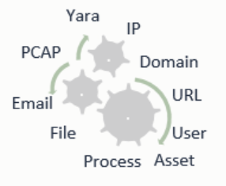

Concepts
========

There are several concept crucial to understanding how ACE works and how to use ACE. For the analyst, it’s important to understand observables, and tagging. For the administrator or developer, it’s crucial to understand ACE’s dependencies and its engine and module based architecture.

Observables
-----------

Observables are artifacts or meta data that an analyst can and normally would take note of during an investigation. For example, an analyst working a snort alert may discover an IP address of interest. That IP address would be an observable. Likewise, an email message id could be an observable, or a username, hostname, etc. Just like the analyst working an alert, ACE takes every observable it finds when performing alert analysis and correlates those observables with all available data sources. ACE’s correlation reduces and simplifies the analysts workload by providing the analyst with as much available context as reasonably possible.

Currently defined ACE observables:

==================  ===================================================================================================
Observable Type     Description
==================  ===================================================================================================
asset               a F_IPV4 identified to be a managed asset
cidr                IPv4 range in CIDR notation
email_address       email address
email_conversation  a conversation between a source email address (MAIL FROM) and a destination email address (RCPT TO)
file                path to an attached file
file_location       the location of file with format hostname@full_path
file_name           a file name (no directory path)
file_path           a file path
fqdn                fully qualified domain name
hostname            host or workstation name
http_request        a single HTTP request
indicator           crits indicator object id
ipv4                IP address (version 4)
ipv4_conversation   two F_IPV4 that were communicating formatted as aaa.bbb.ccc.ddd_aaa.bbb.ccc.ddd
md5                 MD5 hash
message_id          email Message-ID
pcap                path to a pcap formatted file !!! DEPRECATED (use F_FILE instead)
process_guid        CarbonBlack global process identifier
sha1                SHA1 hash
sha256              SHA256 hash
snort_sig           snort signature ID
url                 a URL
user                an NT user ID identified to have used a given asset in the given period of time
yara_rule           yara rule name
==================  ===================================================================================================

Engines
-------

The ACE system is named after the system's core engine, the Analysis Correlation *Engine*. However, there are additional engines that interface with, utilize, or provide input to the core Analysis Correlation Engine. Below is a table of the currently defined engines:

+---------------+--------------------------------------------------------------------------------------------------------------+
|   Engine      |                                       Description                                                            |
+===============+==============================================================================================================+
| ace           | The Alert Correlation Engine creates and submits alerts to the Analysis Correlation Engine                   |
+---------------+--------------------------------------------------------------------------------------------------------------+
| carbon_black  | Collects binaries and files from CarbonBlack environments and runs them through ACE                          |
+---------------+--------------------------------------------------------------------------------------------------------------+
| brotex_stream | Responsible for analyzing tar files extracted from SMTP and HTTP streams via the Brotex system [#]_.         |
|               | Extracted emails are submitted to the Email Scanning Engine. Extracted HTTP streams are submitted to the     |
|               | HTTP Scanning Engine.                                                                                        |
+---------------+--------------------------------------------------------------------------------------------------------------+
| email_scanner | The Email Scanning Engine is configured to fully analyze and scan emails from any available source. There is |
|               | special support for emails submitted from Office365 (which includes the actual email as an attachment inside |
|               | the email.) The two sources of input for the Email Scanning Engine are the emails parsed out of tar files    |
|               | from the Brotex Engine, which are submitted via local filesystem, and emails collected from the ACE Mailbox  |
|               | Client systems [#]_, which are submitted via custom SSL connections. Emails that have any alert-able         |
|               | properties are submitted to the Alert Correlation Engine.                                                    |
+---------------+--------------------------------------------------------------------------------------------------------------+
| http_scanner  | Processes and scans individual HTTP requests for malicious content, alert-able requests are submitted to the |
|               | Alert Correlation Engine.                                                                                    |
+---------------+--------------------------------------------------------------------------------------------------------------+
| cloudphish    | Processes, analyzes, crawls, and scans content pulled from received URLs. Maintains a cache of results and a |
|               | URL whitelisting system. Alert-able URLs are sent to the Alert Correlation Engine. Cloudphish has an API.    | 
+---------------+--------------------------------------------------------------------------------------------------------------+

.. [#] See the Brotex systems on IntegralDefense's github page: https://github.com/IntegralDefense
.. [#] The ACE Mailbox Client is open sourced at https://github.com/IntegralDefense/amc.git

Modules
-------

ACE modules automate something that an analyst has previously done manually. These modules do all "the work" on observables; each module knows which types of observables it works with and "knows what to do" with those observables. Modules can be built to do anything that you can automate. Each ACE Engine knows which ACE modules to work with and modules can perform work for many different Engines.

Recursive Correlation & Analysis
--------------------------------

With the introduction of observables, engines, and modules, you can begin to understand how ACE performs its recursive analysis and correlation.  

For example, given observable type 'file', each ACE module that acts on an observable of type file will be called to perform its analysis.  From the output of each module’s analysis, ACE will discover and create new observables, which, kicks off more modules to perform analysis.  This recursive process will continue until all observables are discovered, analyzed, and correlated, or, until a specified alert correlation timeout is reached. ACE’s default timeout limit for recursive alert analysis is 15 minutes, however, a warning will be logged if alert analysis exceeds five minutes. These values are configurable. 

Intuitive Presentation
----------------------

ACE maintains the relationships between all discovered observables and the 'root' level alert observable(s) when performing its recursive analysis. The maintenance of those observable relationships allows for the data to be visually presented to the analyst in a contextually intuitive way. This helps accomplish ACE's goal of displaying everything the analyst needs to disposition an alert, right on the alert page.
