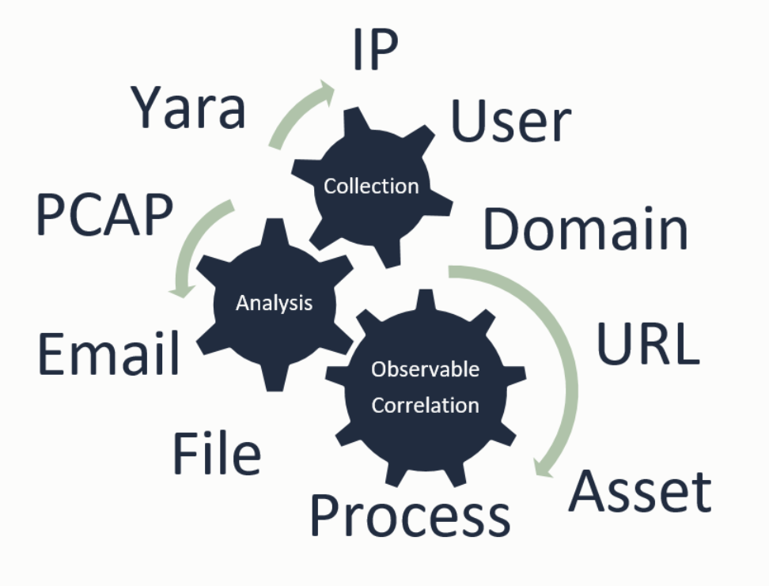

.. Analysis Correlation Engine documentation master file, created by
   sphinx-quickstart on Tue Aug 21 09:51:05 2018.
   You can adapt this file completely to your liking, but it should at least
   contain the root `toctree` directive.

ACE: Analysis Correlation Engine
=======================================================

Release v\ |release|.

For every security operation, the number one metric to drive should be how long it takes to determine if an Alert is a False Positive or True Positive. Ideally, False Positive Alerts are confidently, and accurately, recognized in seconds. Allowing for analysts to focus on Alerts that require some form or a response.

What if you had a magical tool that somehow, for each alert, gave the analyst enough information that he or she could quickly determine that the alert was a False Positive? How would that affect things?

   Observable Analysis & Correlation

ACE **is NOT** a SIEM... but, it *kinda*, *sorta*, acts like one.

Other tools, hunters, smtp listeners, splunk hunters, elk hunters, take one sigle detectable condition and send an Alerts to ACE. ACE then spiders out through its recursive analysis of observables and hopefully hits as many detections points on the attack surface, as possible.

Unlike a SIEM, ACE takes

ACE **is** ..

* an email scanner
* a detection tool set and platform
* an automation framework
* a recursive file scanner
* a URL crawler and cacher
* a system for automated, recursive, data analysis and correlation
* and more..

Built for the information security team, ACE is the implementation of a proven detection strategy, a framework for automating analyst tasks and methods, a central platform to launch and manage incident response and remediation activites, an email scanner, and much more.

ACE's core strength is the automation of the ordinary, manual, redundant, and repetitive tasks of collecting, combining, and relating data, in such a way, as to present security analysts with all the right data needed to give a quick, high confidence disposition.

Regardless of skill level, ACE greatly reduces the time it takes an analyst to make a high confidence disposition. This reduction in time-to-disposition, coupled with the appropriate hunting and tuning mindset, means that security teams can greatly increase their attack surface coverage, all while utilizing the same amount of analyst time and practically eliminating alert fatigue.

Major Features
--------------

+ Email Scanning
+ Recursive File Scanning
+ URL Crawling and Content Caching
+ Intuitive Alert Presentation
+ Recursive Data Analysis & Correlation
+ Central Analyst Interface
+ Event management
+ Intel Ingestion
+ Modular, bolt-on Design

.. toctree::
   :maxdepth: 3
   :caption: Contents:

   installation
   analyst-orientation
   work-in-progress
   user-guide
   admin-guide
   developer-guide

Indices and tables
==================

* :ref:`genindex`
* :ref:`modindex`
* :ref:`search`
