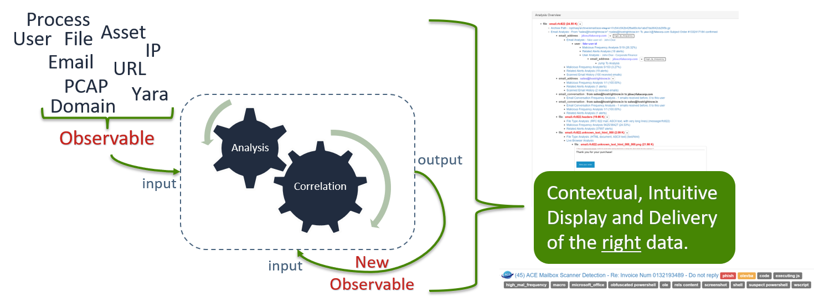

.. Analysis Correlation Engine documentation master file, created by
   sphinx-quickstart on Tue Aug 21 09:51:05 2018.
   You can adapt this file completely to your liking, but it should at least
   contain the root `toctree` directive.

ACE: Analysis Correlation Engine
=======================================================

Release v\ |release|.

ACE is a detection system and automation framework. At ACE’s foundation are its engines for recursive analysis and its delivery of an intuitive presentation to the analyst. ACE's goal is to reduce the analyst's time-to-disposition to as close to zero as humanly possible.

While ACE is a powerful detection system, and does have built in detections, ACE does not ship with all of the yara signatures and intel detections that teams have built around it. However, ACE makes it easy to load your own yara signatures and atomic indicator detections.

Alerts are sent to ACE, and ACE handles the ordinary, manual, redundant, and repetitive tasks of collecting, combining, and relating data. ACE will then contextually and intuitively present all the right data to the analyst, allowing for a quick, high confidence determination to be made. 

Got some new analysis that can be automated? Awesome! Add your automation, and let ACE keep working for you.

   Recursive Analysis; Presentation

For the most part, custom hunting tools send alerts to ACE using ACE’s client library (API wrapper). ACE then gets to work by taking whatever detectable conditions it’s given and spiraling out through its recursive analysis of observables, hitting as many detection points as possible across the attack surface.

Regardless of skill level, ACE greatly reduces the time it takes an analyst to make a high confidence determination, or as we call it, disposition. This reduction in time-to-disposition, coupled with the appropriate hunting and tuning mindset, means that security teams can greatly increase the attack surface they cover, all while utilizing the same amount of analyst time and practically eliminating alert fatigue. Optimization good, alert fatigue bad.

Major Features
--------------

ACE is the implementation of a proven detection strategy, a framework for automating analysis, a central platform to launch and manage incident response activates, an email scanner, and much more.

+ Email Scanning
+ Recursive File Scanning
+ URL Crawling and Content Caching
+ Intuitive Alert Presentation
+ Recursive Data Analysis & Correlation
+ Central Analyst Interface
+ Event/Incident management
+ Intel Ingestion
+ Modular Design for extending automation

.. image:: _static/analyst_on_ace.png

.. toctree::
   :maxdepth: 3
   :caption: Contents:

   installation
   analyst-orientation
   education 
   additional
   admin-guide
   developer-guide

Indices and tables
==================

* :ref:`genindex`
* :ref:`modindex`
* :ref:`search`
