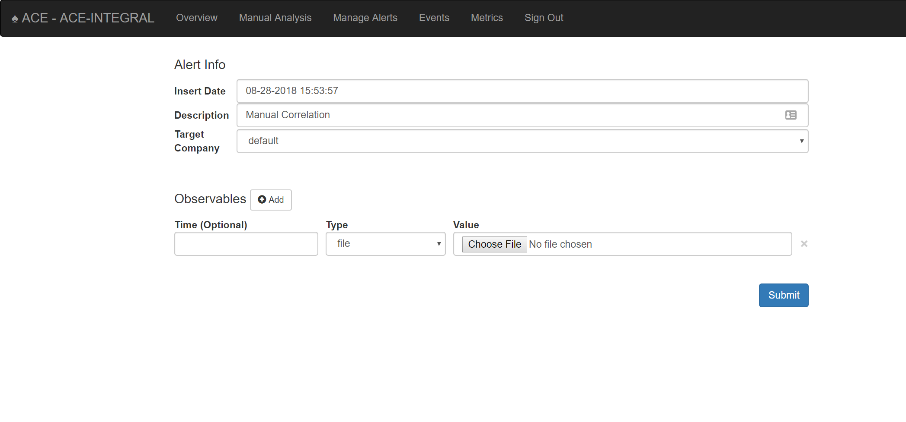

.. It might make sense to have a the high-level (super fast) how-to at the
   top, under installation, but then make each step links to a more detailed
   sub-section breaking down each step

Installation + Adding Data
==========================

Super fast How-To
-----------------

#. Clean Ubuntu 18 install.
#. Create username/group ace/ace.
#. Add ace to sudo.
#. Login as user ace.
#. `sudo mkdir /opt/ace && sudo chown ace:ace /opt/ace && cd /opt/ace`
#. `git clone https://github.com/IntegralDefense/ACE.git .`
#. `./installer/source_install`
#. `source load_environment`
#. `./ace add-user username email_address`
#. Goto https://127.0.0.1/ace/ or whatever IP address you're using.

Detailed Installation
---------------------

Install Ubuntu Server 18.04 LST
+++++++++++++++++++++++++++++++

The size specifications for your server need to be based on your needs. At a minimum, the server should have 4 GB RAM and 20 GB storage drive. When installing the server, all of the default configurations are fine.

.. _get-enviro-ready:

Getting Everything Ready
++++++++++++++++++++++++

The ace User
~~~~~~~~~~~~

::

  $ sudo adduser ace
  $ sudo adduser ace sudo
  $ sudo su - ace
  $ sudo chown ace:ace /opt

Cloning ACE
~~~~~~~~~~~

As the ace user you previously created, cd into /opt and git clone the IntegralDefense ACE master branch: https://github.com/IntegralDefense/ACE.git::

  $ cd /opt
  $ git clone https://github.com/IntegralDefense/ACE.git

.. _source.list:

Run the Installer
+++++++++++++++++

With :ref:`everything ready <get-enviro-ready>`, you can now run the ACE installer. Run the installer as the ace user. This will take a little while to complete.

::

  $ cd /opt/ace
  $ ./installer/source_install

Set Up Environment
++++++++++++++++++

Next, you will need to load the default environment variables ACE depends on. This load needs to be sourced from bash with the following command::

  $ source load_environment

Create Users
++++++++++++

Users are managed from the ACE command line with the following ace commands::

    add-user            Add a new user to the system.
    modify-user         Modifies an existing user on the system.
    delete-user         Deletes an existing user from the system.

Create your first user so that you can log into the ACE GUI::

  ./ace add-user <username> <email_address>

Log into the GUI
++++++++++++++++

You should now be able to browse to https://your_ip/ace/ and log into ACE with the user you previously created.

Troubleshooting & Help
----------------------

There are a couple snags and gotchas that you can run into when installing ACE. This section will detail a few, but it's still a work in process. So, please send any issues or questions to ace-support@integraldefense.com. Please include as much detail as possible and we will get back to you as soon as we can. Thanks!

.. _get-data-in:

Getting Data into ACE
---------------------

A bare-bones ACE install is not going to be very effective by itself, much less without data. You can use the `Manual Analysis`_ section to submit observables to ACE. However, you're going to want to turn on some of the additional :ref:`Engines` and :ref:`Modules` that come with ACE by default. Firt, turning on the :ref:`Correlation Engine` is essential. Some other good engines to turn on first are the :ref:`Cloudphish` engine and the :ref:`Email Scanning <email-scanning>` engine and if you've got yara signatures, definitely turn on the :ref:`Yara Scanner` module. See the :ref:`Administration Guide` for more details on the various engines, modules, and how to turn them on.

Manual Analysis
+++++++++++++++

Via the Manual Analysis page, an analyst can submit an observable for ACE to analyze.

.. _manual-analysis-page:

   Observables can be submitted for analysis via the Manual Analysis page

By default, the Insert Date is set to the current time, and the Description is set to 'Manual Correlation'. You can change the description to something meaningful. The Target Company will also be set to default, which should be fine for most ACE installations.

Select the type of observable you wish to correlate and then provide the value. Click the Add button to correlate more than one observable type and/or value at a time.

Shortly after you've submitted your observable(s) for correlation, you will see your alert appear on the Manage Alerts page with the description you provided. The alert status will change to 'Complete' once ACE is finished performing its analysis. You must currently refresh the Manage Alerts page to see the alert status updates.
