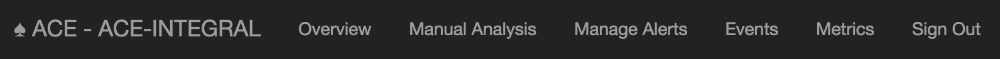
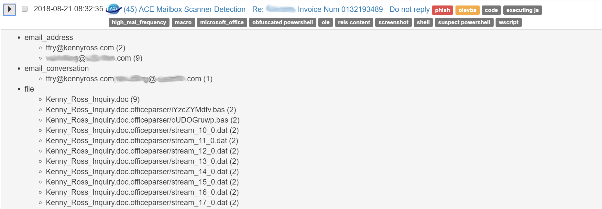

User/Analyst Guide
==================

GUI Overview
------------

Generally, analysts interact with ACE through it's graphical interface. The ACE GUI has a few different pages, below is a breakdown of what each page is used for:

===============  =============== 
     Page        Function
===============  ===============
Overview         Gives an overview of ACE's performance and statistics
Manual Analysis  Where analysts can upload or submit observables for ACE to analyze
Manage Alerts    The ACE alert queue
Events           Where EventSentry events are managed
Metrics          For creating and tracking metrics from the data ACE generates
===============  ===============

Managing Alerts
---------------

All alerts are managed via the queue on the Manage Alerts page. The alert management page is where analysts spend most of their time interacting with ACE. Each alert, in the queue, is intended to evoke the correct emotion in the analyst when viewed. To accomplish this, there are several features for the analyst to understand when working with alerts; to name a couple of the most important: observables, dispositions, tagging, and alert filtering. Oberservables are a core concept that can be reviewed, in the documentation, under :doc:`Concepts </concepts>`. An example of the the Manage Alerts page follows.

.. _ace-gui-alerts-page:
.. figure:: _static/ACE\ gui-medium.png

   The Manage Alerts page

Expanding Alert Observables
~~~~~~~~~~~~~~~~~~~~~~~~~~~

On the Manage Alerts page, each alert can be expanded via its dropdown button. Once expanded, all of the observables in the alert can be viewed. The observables are grouped and listed by their observable type. The numbers, in parentheses, at the end of each observable, show a count of how many times ACE has seen that particular observable. Each observable is clickable, and when clicked, ACE will add that observable to its current alert filter. An upcoming section has more on alert `Filtering and Grouping`_.

   An expanded alert shows it observables

.. container:: toggle

   .. container:: header

      **Expand/Collapse Observables**

   ::

       - email_address
         - fakeuser@fakecompany.com (21)
         - tfry@kennyross.com (2)
       - email_conversation
         - tfry@kennyross.com|fakeuser@fakecompany.com (1)
       - file
         - 308591a9db1d3b8739e53feaf3dd5ba069f7191125cf3bb7e2c849bad2182e98.vxstream/dropped/1LSZPI0TG6C82HTABETK.temp (1)
         - 308591a9db1d3b8739e53feaf3dd5ba069f7191125cf3bb7e2c849bad2182e98.vxstream/dropped/Kenny_Ross_Inquiry.LNK (1)
         - 308591a9db1d3b8739e53feaf3dd5ba069f7191125cf3bb7e2c849bad2182e98.vxstream/dropped/index.dat (1)
         - 308591a9db1d3b8739e53feaf3dd5ba069f7191125cf3bb7e2c849bad2182e98.vxstream/dropped/urlref_httpvezopilan.comtstindex.phpl_soho7.tkn_.Split (1)
         - Kenny_Ross_Inquiry.doc (9)
         - Kenny_Ross_Inquiry.doc.officeparser/iYzcZYMdfv.bas (2)
         - Kenny_Ross_Inquiry.doc.officeparser/oUDOGruwp.bas (2)
         - Kenny_Ross_Inquiry.doc.officeparser/stream_10_0.dat (2)
         - Kenny_Ross_Inquiry.doc.officeparser/stream_11_0.dat (2)
         - Kenny_Ross_Inquiry.doc.officeparser/stream_12_0.dat (2)
         - Kenny_Ross_Inquiry.doc.officeparser/stream_13_0.dat (2)
         - Kenny_Ross_Inquiry.doc.officeparser/stream_14_0.dat (2)
         - Kenny_Ross_Inquiry.doc.officeparser/stream_15_0.dat (2)
         - Kenny_Ross_Inquiry.doc.officeparser/stream_16_0.dat (2)
         - Kenny_Ross_Inquiry.doc.officeparser/stream_17_0.dat (2)
         - Kenny_Ross_Inquiry.doc.officeparser/stream_18_0.dat (2)
         - Kenny_Ross_Inquiry.doc.officeparser/stream_19_0.dat (2)
         - Kenny_Ross_Inquiry.doc.officeparser/stream_1_0.dat (2)
         - Kenny_Ross_Inquiry.doc.officeparser/stream_2_0.dat (2)
         - Kenny_Ross_Inquiry.doc.officeparser/stream_2_0.dat.extracted/WXRIK/WXRIK/WXRIK1.lrA (2)
         - Kenny_Ross_Inquiry.doc.officeparser/stream_2_0.dat.extracted/WXRIK/WXRIK/WXRIKManager.lrA (2)
         - Kenny_Ross_Inquiry.doc.officeparser/stream_2_0.dat.extracted/WXRIK/WXRIK/_pPOR/WXRIKManager.lrA.pPOR (2)
         - Kenny_Ross_Inquiry.doc.officeparser/stream_2_0.dat.extracted/[Content_Types].lrA (2)
         - Kenny_Ross_Inquiry.doc.officeparser/stream_2_0.dat.extracted/_pPOR/.pPOR (2)
         - Kenny_Ross_Inquiry.doc.officeparser/stream_3_0.dat (2)
         - Kenny_Ross_Inquiry.doc.officeparser/stream_4_0.dat (2)
         - Kenny_Ross_Inquiry.doc.officeparser/stream_5_0.dat (2)
         - Kenny_Ross_Inquiry.doc.officeparser/stream_8_0.dat (2)
         - Kenny_Ross_Inquiry.doc.officeparser/stream_9_0.dat (2)
         - Kenny_Ross_Inquiry.doc.olevba/macro_0.bas (2)
         - Kenny_Ross_Inquiry.doc.olevba/macro_1.bas (2)
         - Kenny_Ross_Inquiry.doc.pcode.bas (2)
         - email.rfc822 (37952)
         - email.rfc822.headers (37949)
         - email.rfc822.unknown_text_html_000 (3229)
         - email.rfc822.unknown_text_html_000_000.png (2482)
         - email.rfc822.unknown_text_plain_000 (37354)
         - filename.PNG (11)
       - indicator
         - 55c36786bcb87f2d54cf15da (369)
         - 57ffd02cbcb87fbb1464b1ce (88)
         - 58c9708aad951d7387c65be2 (274)
         - 58e3e8dfad951d49aabb1622 (384)
         - 58ee209dad951d09a1ee3860 (92)
         - 58ee221dad951d09a0b13e99 (92)
         - 5937f5d4ad951d4fe8787c63 (672)
         - 599db056ad951d5cb2c4768b (302)
         - 599dd8abad951d5cb3204569 (155)
         - 59a7fcc7ad951d522eeef8ed (380)
       - ipv4
         - 104.118.208.249 (24)
       - md5
         - 2307a1a403c6326509d4d9546e5f32ab (2)
         - 267b1bd0ae8194781c373f93c9df02fa (2)
         - 39ee938f6fa351f94a2cbf8835bb454f (2)
         - 5c4c76cbb739c04fb3838aff5b2c25bb (2)
         - 65811d8f7c6a1b94eab03ba1072a3a7e (2)
         - b3b8bf4ed2c5cb26883661911487d642 (2)
         - d8a7ea6ba4ab9541e628452e2ad6014a (2)
       - message_id
         - <8de41f6eb57ac01b2a90d3466890b0a1@127.0.0.1> (1)
       - sha1
         - 03484a568871d494ad144ac9597e9717a2ae5601 (2)
         - 2e3b95bb9b0beb5db3487646d772363004505df6 (2)
         - 33b9d3de33adc5bd5954c1e9f9e48f10eabe7c49 (2)
         - 62837876eb5ec321e6d8dbd6babd0d5789230b60 (2)
         - b3024c6f598b1745ca352ac3a24cc3603b814cad (2)
         - cfe4f07fbf042b4f7dce44f9e6e3f449e02c123a (2)
         - fa47ebc1026bbe8952f129480f38a011f9faf47d (2)
       - sha256
         - 308591a9db1d3b8739e53feaf3dd5ba069f7191125cf3bb7e2c849bad2182e98 (2)
         - 50aef060b9192d5230be21df821acb4495f7dc90416b2edfd68ebebde40562be (2)
         - 62be2fe5e5ad79f62671ba4b846a63352d324bb693ee7c0f663f488e25f05fe0 (2)
         - 8159227eb654ef2f60eb4c575f4a218bb76919ea15fdd625c2d01d151e4973f3 (2)
         - 9c7e06164ec59e76d6f3e01fa0129607be1d98af270a09fd0f126ee8e16da306 (2)
         - ae67f33b6ff45aecf91ff6cac71b290c27f791ccbe4829be44bd64468cbe3f5d (2)
         - ca797ec10341aebaed1130c4dbf9a5b036945f17dd94d71d46f2f81d9937504f (2)
       - url
         - http://schemas.openxmlformats.org/drawingml/2006/main (3796)
       - user
         - fake_user_id (17)
       - yara_rule
         - CRITS_EmailContent (4478)
         - CRITS_StringOffice (1685)
         - CRITS_StringVBS (6592)
         - CRITS_StringWindowsShell (1770)
         - macro_code_snippet (1013)
         - macro_overused_legit_functions (82)

Above, you can click to expand a text based example of an alerts observable structure when an alert is expanded on the Manage Alerts page.

Alert Tags
~~~~~~~~~~

ACE has a tagging system, by which observables are tagged for the purpose of providing additional context about an alert’s observables.  If you review the previous figure of :ref:`ace-gui-alerts-page` you will notice the tags, such as, phish, new_sender, frequent_conversation associated to various alerts.
All of an observables tag’s get associated with the respective alert and show up on the alert management page. Any observable can be tagged and can have any number of tags. For instance, an email conversation between two addresses that ACE has seen a lot will be tagged as 'frequent_conversation'. Tags can also be added directly to alerts from the Manage Alerts page. This can be helpful for `Filtering and Grouping`_ alerts if an analyst needs a way to group alerts that don’t otherwise have a commonly shared tag or observable.

Alert Page
~~~~~~~~~~

At the top of each alert page you will see the title of the alert, followed by a table providing the details on where the alert came from and what kind of alert it is. The following fields are present at the top of every alert, underneath the title:

    :Company: The company this alert corresponds to, if applicable. Something like: FakeCompany
    :Alert Time: The datetime this alert was created, in YYYY-MM-DD HH:MM:SS format
    :Source: Where this alert came from. Something like: ACE - Mailbox Scanner
    :Instance: The ACE server this alert came from (If you're running a distributed, multi-instance ACE). Something like: ace-fakecompany1
    :Alert Type: They type of alert this is
    :Storage: The path, on the server where all of the alert data is stored. Something like: data/ace-fakecompany1.local/7d5/7d53d3aa-c48d-4534-b7a6-5a4be4e8289e
    :Priority: The estimated priority of the alert
    :Status: The analysis state of the alert. This could be 'Analyzing', 'Delayed', or 'Completed'
    :Detections: The number of detections found on this alert

Next, depending on the alert type, there may be more high-level context information provided. For instance, if it's a mailbox alert, there will be a meta-data summary of the email. Followed by an expandable section to display the raw email headers and then, if email remediation is implemented, email remediation history. Other alerts, such as CRITS or Snort alerts, will have a section showing the raw log results for which the alert was generated. All that being said, every alert will have an `Analysis Overview`_ section. The contextual results of ACE's recusive observable analysis is displayed in the `Analysis Overview`_ section.

Views
+++++

There are two different modes you can view ACE alerts in, 'Critical' and 'All'.  By default, ACE alerts will be displayed in critical mode. Critical mode will only display 'root' level alert observables. This is helpful for alerts with a lot of observables, however, generally, it's most helpful to view all of an alert's analysis. At the top right of every alert you will see a button to "View All Analysis". Whichever mode you have enabled will be persistent accross your ACE session.

Be mindful of these different views, as it's possible for an analyst to miss crucial information if viewing an alert in crucial mode, verse all mode. For instance, if you were viewing a snort alert in crucial mode, it wouldnt' be as obvious that an extracted pcap file is attached to the alert.

Analysis Overview
+++++++++++++++++

The Analysis Overview section will contain the results from every ACE module that performed work on all of the alert observables. In this section, the observables displayed at the root level are the observables that were directly discovered in the data provided to ACE at the time of the alert's creations. Underneath each observable you will find the output of the various ACE modules that ran analysis the respective observable. You may also see some general details about the observable. For example, every ACE email alert will have a root level file observabled named 'email.rfc882'. Under that observable you will see the output of the Email Analysis module. Underneath Email Analysis, you will find many more observables discovered from the modules analysis output, such as email addresses, email conversations, urls, files, etc. Of course, each of those observables will have any useful output from the modules that analyze those observables. For example, if the value of an email_address observable was found in the corporate domain via an LDAP query, you will find a user observable with summary details of the user. All of these analysis sections are clickable, which allows the analyst to view the output of an analysis module in greater detail. The following figure shows the Analysis Overview section of an email, user identification has been removed or obscured.

.. figure:: _static/

   The Analysis Overview section of an email alert

At the bottom of the figure above, notice the 'Live Browser Analysis' section. The Live Browser module renders a visual image of html content in emails for the analyst's convienience.

Scrolling down on the same alert from the example above, we see the 'URL Extraction Analysis' found some url observables. Each of those urls were submitted to ACE's cloudphish engine. The next figure shows that cloudphish discovered detection(s) in its analysis of that first url. We see that a zip file was found and downloaded. Further we see that the respective file analysis modules analyzed that zip file and extracted the exe inside.

.. figure:: _static/

   URL Extraction analysis shows more observables

When viewing the figure below, note the dropdown to the right of those file observables. Expanding that dropdown reveals additional actions you can take with respect to a file observable, actions such as, downloading the file or viewing any availble sandbox analysis for the file.

.. figure:: _static/

   Additional file observable actions

Filtering and Grouping
~~~~~~~~~~~~~~~~~~~~~~
