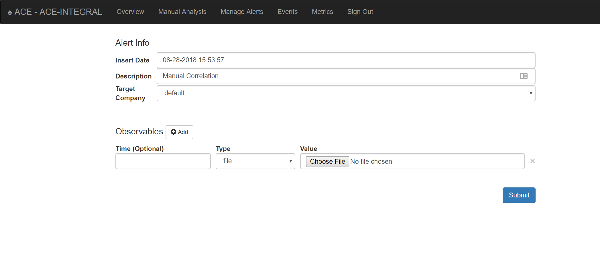

Leftovers for the User Guide
============================

This User Guide is meant to be a complete guide to the ACE system, including everything from the underlying philosphy that lead to the development of ACE to a detailed description of the core concepts, high-level moving parts of ACE, a detailed breakdown of all of ACE's features and how to use them.

Manual Analysis
---------------

Via the Manual Analysis page, an analyst can submit an observable for ACE to analyze.

.. _manual-analysis-page:

   Observables can be submitted for analysis via the Manual Analysis page

By default, the Insert Date is set to the current time and the Description set to 'Manual Correlation'. You should go ahead and change the description to something meaningful. The Target Company will also be set to default, which should be fine for most ACE installations.

Select the type of observable you wish to correlation and then provide the value. Click the Add button to correlate more than one observable type and/or value at a time.

Shortly, after you've submitted your observable(s) for correlation, you will see your alert appear on the Manage Alerts page with the description you provided. The alert status will change to 'Complete' once ACE is done performing its analysis. Currently, you must manually refresh the Manage Alerts page for status updates.

Events
------

The Events page provides an interface for managing ACE event response activities.  ACE uses Event Sentry for managing the events analysts make and provides a user-friendly view of ACE events. Event Sentry is a powerful intel analysis automation tool. See https://eventsentry.readthedocs.io/en/latest/ for more information on Event Sentry.

Metrics
-------

ACE's Metrics page can be used to track and display metrics for alert triage operations. Currently, the following tables can be generated:

    :Alert Quantities: Count of alerts by disposition
    :Hours of Operation: Cycle time averages and quantities by the time of day alerts were generated
    :Alert Cycle Times: The average time it took to disposition alerts, in Business hours
    :Incidents: Summary of incidents
    :Events: Summary of events
    :CRITS Indicator Stats: Count of indicators by intel source, and count by status

